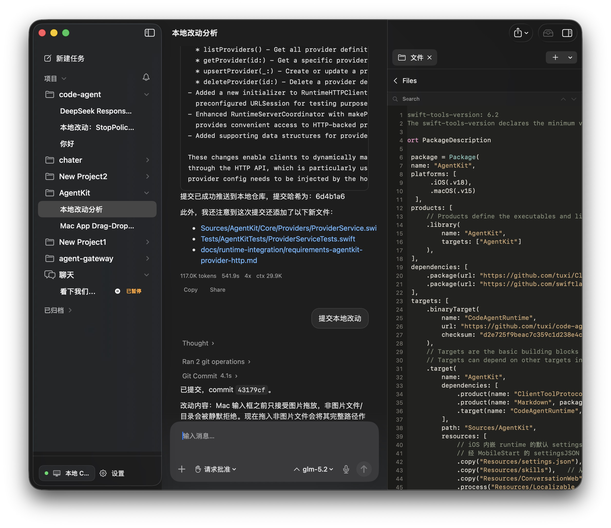
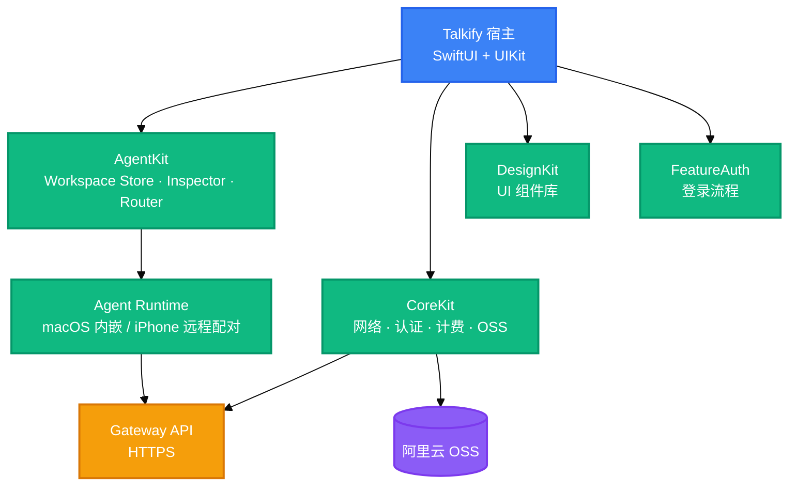

<h1 align="center">Talkify</h1>

<p align="center">
  <strong>工作区优先的 AI Agent 客户端，支持 iOS 与 macOS</strong>
  <br />
  <em>工作区对话 · Inspector 工具面板 · 跨设备 Runtime · 本地设备工具</em>
</p>

<p align="center">
  <a href="#快速开始"></a>
  <a href="LICENSE"></a>
</p>

<p align="center">
  
  
  
  
  
</p>

<p align="center">
  
</p>
<p align="center"><em>工作区对话 · 本地改动分析 · Inspector 文件树</em></p>

---

## 功能特性

| 功能 | 说明 |
|---|---|
| 工作区优先对话 | 会话围绕工作区展开，文件是一等公民：Agent 可直接读写文件，变更以 FileChangeCard 形式呈现在消息流中 |
| Inspector 工作台 | 工具调用详情、文件 diff、工作区文件树统一收纳于侧边面板，支持嵌套导航 |
| 跨设备 Runtime | macOS 内嵌 Agent Runtime；macOS 可将 Runtime 以二维码邀请分享给 iPhone，扫码后经证书固定建立加密连接 |
| 本地设备工具 | 相机拍照、文件下载、PDF 读取/渲染/合并、录音与转写、本地图片分析、截图（macOS）等设备能力注册给 Agent 调用 |
| 多 Provider 连接 | 网关与第三方模型统一目录，模型列表、默认模型与凭据集中管理 |
| 用户资产与计费 | 用户图片经 OSS 上传托管、积分与订阅中心、用量额度与重置卡 |

## 快速开始

### 环境要求

- macOS 15+、Xcode 16+（Swift 6.2）
- iOS 17+（FeatureAuth 包要求 iOS 18）
- 运行 Agent 会话需要可用的 Agent Runtime（macOS 使用内嵌 Runtime，iOS 通过配对连接远程 Runtime）

### 打开工程

```bash
open Talkify.xcodeproj
```

Xcode 会自动解析 Swift Package 依赖：本地包（AgentKit、CoreKit、DesignKit、FeatureAuth）与远程依赖（Alamofire、AlibabaCloud OSS SDK、Kingfisher 等）。

### 选择 Scheme 并运行

| Scheme | 用途                                      |
|---|-----------------------------------------|
| `Talkify` | iOS 客户端                                 |
| `Talkify-MacAppStore` | Mac App Store 分发（沙盒 + 受控 entitlements）  |
| `Talkify-MacDirect` | 直接分发（Developer ID 签名，避免受限 entitlements） |

按 `⌘R` 运行。

## 使用方法

### 工作区深链

从外部应用（如终端或 Share Extension）唤醒并定位到指定工作区：

```
talkifyapp://workspace?path=/Users/xxx/my-project
```

macOS 端同时会在 Finder 中打开该路径；iOS 端跳转到工作区浏览器并选中对应工作区。

### 注册客户端工具

宿主在启动时向 `ToolRegistry` 注册本机可执行工具，供 Agent 调用：

```swift
await toolRegistry.register(DeviceInfoTool())
await toolRegistry.register(CameraCaptureTool())
await toolRegistry.register(DownloadFileTool())
await toolRegistry.register(ReadPDFTool())
await toolRegistry.register(RecordAudioTool())
await toolRegistry.register(TranscribeAudioTool())
#if os(iOS)
await toolRegistry.register(ScanDocumentTool())
#endif
#if os(macOS)
await toolRegistry.register(ScreenshotTool())
#endif
```

### 分享 macOS Runtime 给 iPhone

macOS 端在设置中生成配对邀请，展示带有效期的二维码（内含 Server ID、地址与 SPKI 指纹）；iPhone 端扫描二维码，通过证书固定建立加密连接后即可共享该 Runtime 的工作区与工具。

## 架构



设计原则：

- **AgentKit 为外部依赖**：提供工作区存储、Inspector、路由器与 Runtime 客户端，宿主仅做胶水适配。
- **Kit 间单向依赖**：`DesignKit` 依赖 `CoreKit`，`FeatureAuth` 依赖 `CoreKit`；Kit 不反向依赖宿主。
- **iOS 与 macOS 共享核心**：跨平台外壳 `WorkspaceView` 按尺寸类别自适应（iPad/macOS 三栏 `NavigationSplitView`，iPhone `NavigationStack` + Inspector sheet）。

## 配置

构建配置位于 `Configurations/` 下的 xcconfig 文件：

| 变量 | 说明 | 默认值 |
|---|---|---|
| `MARKETING_VERSION` | 版本号 | `2.0.0` |
| `CURRENT_PROJECT_VERSION` | 构建号 | `49` |
| `MACOSX_DEPLOYMENT_TARGET` | macOS 最低部署版本 | `15` |
| `SUPPORTED_PLATFORMS` | 支持的平台 | `macosx` |
| `CODE_SIGN_STYLE` | 签名方式 | `Automatic` |
| `DEVELOPMENT_TEAM` | 开发团队 | `NKW67GFDHM` |

运行环境由 `EnvironmentManager` 管理：DEBUG 构建默认使用本地环境，Release 构建使用生产环境（并强制校验 HTTPS 网关）。

## 目录结构

```
Talkify.xcodeproj/          # Xcode 工程（含三个 scheme）
Configurations/             # xcconfig 构建配置（App Store / Direct / 公共）
Packages/
├── CoreKit/                # 网络 / 认证 / 计费 / OSS / 工具类
├── DesignKit/              # UI 原子组件与主题
└── FeatureAuth/            # 登录流程（Apple 登录 / 一键登录）
Talkify/
├── Agent/                  # AgentKit 身份与认证桥接
├── Billing/                # 订阅、积分与用量
├── Navigation/             # 路由与深链解析
├── OSS/                    # 用户资源上传路径
├── Providers/              # 多模型 Provider 连接
├── RuntimeServers/         # Runtime 配对 / 分享 / 状态指示
├── Settings/               # 设置
├── Shared/                 # Inspector 工作台（跨平台）
├── TalkifyIOS/             # iOS 交互层（聊天、工作区中心、分享导入）
├── TalkifyMac/             # macOS 交互层（侧栏、工作区、根视图）
├── UI/                     # 应用菜单
└── UserAssets/             # 用户图片资产（上传 / 预览 / 缓存）
TalkifyShareExtension/      # 分享扩展（唤醒主应用 + 工作区导入）
TalkifyTests/               # 单元测试
docs/                       # 架构、分发与法律文档
```

## 技术栈

### 语言与 UI

| 技术 | 用途 |
|---|---|
| Swift 5/6 | 主语言 |
| SwiftUI | 跨平台界面 |
| UIKit / AppKit | 平台特定交互（iOS 抽屉容器、macOS 菜单） |

### 架构与框架

| 技术 | 用途 |
|---|---|
| AgentKit | 工作区存储、Inspector、路由器、Runtime 客户端 |
| Swift Package Manager | 依赖与包管理 |
| @Observable | 状态管理 |
| Alamofire | 网络请求 |
| WebSocket | 实时通道 |

### 数据与云服务

| 技术 | 用途 |
|---|---|
| Keychain / App Group | 凭据与跨进程共享 |
| 阿里云 OSS | 用户资产上传与托管 |
| Kingfisher | 图片加载与缓存 |
| swift-crypto / swift-asn1 | 加密与证书固定 |

## 贡献

1. Fork 本仓库
2. 创建功能分支（`git checkout -b feat/your-feature`）
3. 提交变更：遵循 Conventional Commits，subject 小写、scope 加括号，如 `feat(l10n): add French strings`；body 使用要点列表
4. 推送分支（`git push origin feat/your-feature`）
5. 发起 Pull Request

## License

[MIT](LICENSE)

Copyright (c) 2026 xiaoyuan

